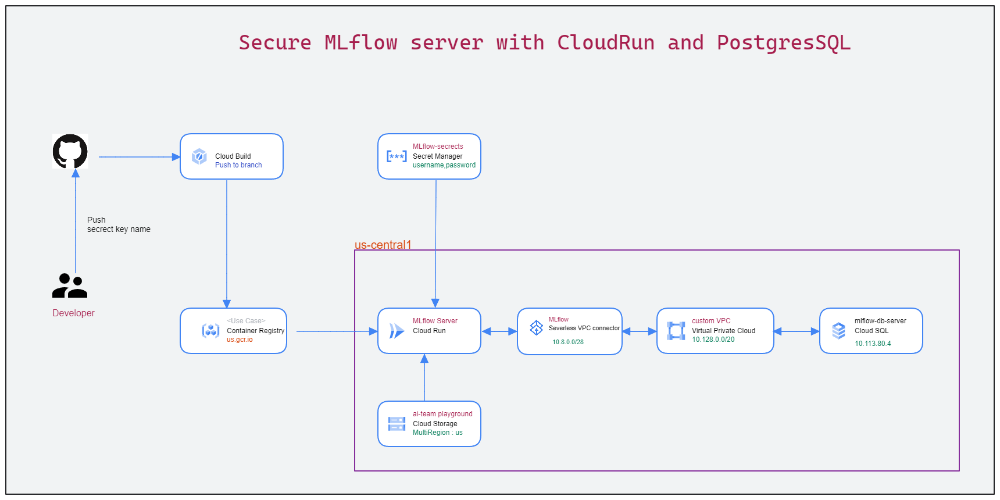

# Secure MLflow server setup for production





### Secret Mananger

In *Secret Manager* you need to configure secrets that the `mlflow` image will retrieve at boot time:

- `mlflow_artifact_url` - path to your *Cloud Storage* bucket, sample value `gs://mlflow`
- `mlflow_database_url` - SQLAlchemy-format *Cloud SQL* connection string (over internal *GCP* interfaces, not through IP), sample value `postgresql+pg8000://<dbuser>:<dbpass>@/<dbname>?unix_sock=/cloudsql/dlabs:europe-west3:mlfow/.s.PGSQL.5432`, the *Cloud SQL* instance name can be copied from *Cloud SQL* instance overview page
- `mlflow_tracking_username` - the basic HTTP auth username for `mlflow`, your choice, sample value `dlabs-developer`
- `mlflow_tracking_password` - the basic HTTP auth password for `mlflow`, your choice


#### Test mlflow locally first
```bash
# test mlflow with your custom artifcat store and database
mlflow ui  --host 127.0.0.1 --port 8080 --default-artifact-root gs://YOUR_GCP_BUCKETNAME  --backend-store-uri postgresql+psycopg2://DB_USERNAME:DB_PASSWORD@DB_IP:5432/DB_NAME
```


#### Test secret manager keys
```bash
sudo python get_secret.py --project ml-in-prod-b1 --secret mlflow_tracking_username
```

#### Test CloudSQL DB with custom backend uri
```bash
## Postgres SQL backend with  pg8000 driver
mlflow ui  --host 127.0.0.1 --port 8080 --backend-store-uri postgresql+pg8000://DB_USERNAME:DB_PASSWORD@DB_IP:5432/DB_NAME

## Postgres SQL backend with  psycopg2 driver
mlflow ui  --host 127.0.0.1 --port 8080 --backend-store-uri postgresql+psycopg2://DB_USERNAME:DB_PASSWORD@DB_IP:5432/DB_NAME
```

#### Build the image and push to Artifcat registry 
```shell


# gcloud commands
export PATH="/Users/tharhtet/google-cloud-sdk/bin:$PATH"
sudo gcloud auth login

# build image
docker build . -t mlflow:latest

# tag image
docker tag mlflow:latest us-central1-docker.pkg.dev/ml-in-prod-b1/cloud-run-source-deploy/mlflow:latest

# push image
sudo docker push us-central1-docker.pkg.dev/ml-in-prod-b1/cloud-run-source-deploy/mlflow:latest


```

#### Run Locally first
```bash

docker run --env GCP_PROJECT=ml-in-prod-b1 -p 8080:8080 mlflow
```

If you can locally run, you can now deploy with any cloud service.
Happy Learning!


#### Reference

- [mlflow-for-gcp](https://github.com/dlabsai/mlflow-for-gcp/tree/master)

- [A Step-by-step Guide To Setting Up MLflow On The Google Cloud Platform](https://dlabs.ai/blog/a-step-by-step-guide-to-setting-up-mlflow-on-the-google-cloud-platform/)
- [How to setup MLflow on Ubuntu](https://medium.com/data-folks-indonesia/how-to-setup-mlflow-in-ubuntu-d79ce47bee2e)
